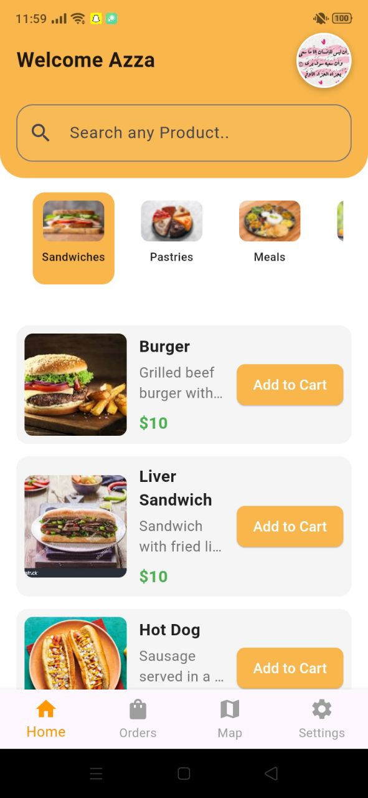
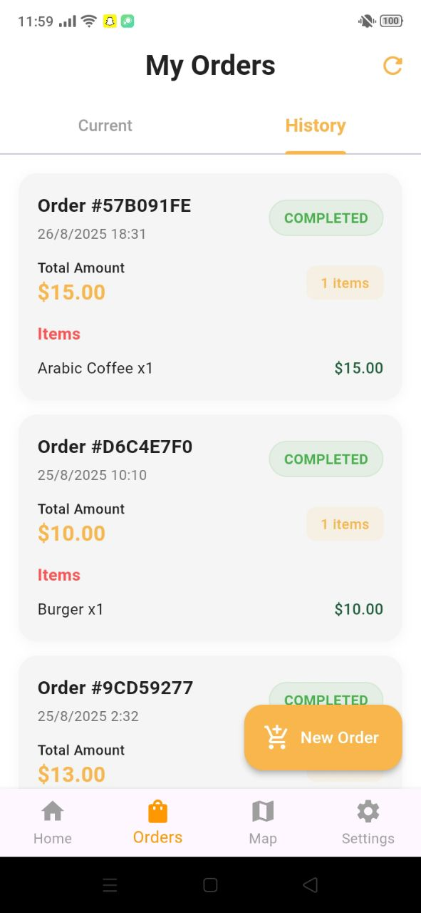
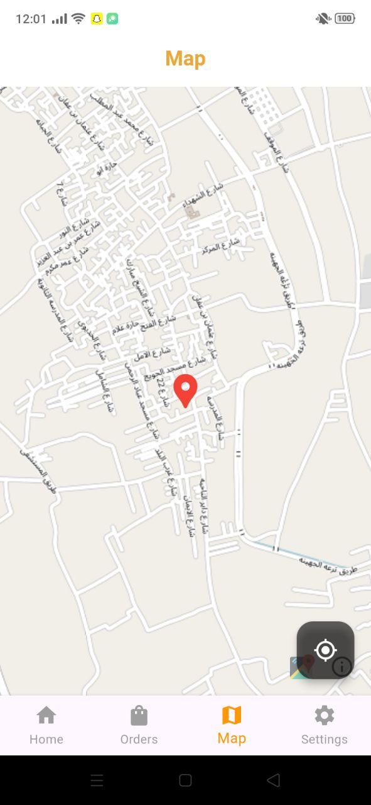

#  Sweet-Pal


---

<p align="center">
  
</p>

**Sweet-Pal** is a modern mobile application built with Flutter and Supabase. The app provides food ordering features with payment integration, map-based location, smart search, and full support for Dark Mode and multiple languages.

> This README is structured to help contributors, reviewers, and new developers quickly understand
> and run the project.

---

## 🔑 Highlights

- ✅ supabase 
- ✅ Home Page Features
- ✅ Map Integration
- ✅ Smart Search
- ✅ Theme Support
- ✅ Payment Integration
- ✅ Clean & Intuitive UI (Flutter)  
- ✅ Secure & Scalable Architecture  


---

## 📸 Screenshots / Preview

> Replace these placeholders with real screenshots from `screenshots/` or `assets/`.

|               Home                     |              Order                       |                Map               |
|:--------------------------------------:|:-------------------------------------------:|:------------------------------------:|
|        |   | |

---

## 🏗️ Architecture Overview

```
lib/
├─ core/ # shared services, constants, themes
├─ features/
│ ├─ auth/ # login, register
│ ├─ home/ # home page, restaurant/product listing
│ ├─ cart/ # shopping cart logic
│ ├─ orders/ # order processing
│ ├─ profile/ # user profile and settings
├─ widgets/ # reusable UI components
└─ main.dart
```

This layout helps keep features self-contained and easier to test.

---

## 🧩 Tech Stack

- Flutter
- Supabase (backend & authentication)
- Cubit (flutter_bloc)
- cached_network_image, image_picker
- Shared Preferences (local storage)
- Google Maps / Location services
- Payment SDK (e.g., Paymob)
- Optional: CI (GitHub Actions) for build & test

---

## 🎯 Design & UX Decisions

- **Colors & Theming** — centralized in `ColorsManager`, supports Light & Dark modes.
- **Product & Restaurant Cards** — clear and legible layout with image, name, rating, price, and add-to-cart button.
- **Navigation** — bottom navigation bar with Home, Menu, Cart, Orders, and Profile.
- **Performance** — image caching, lazy loading, and minimal widget rebuilds.
- **Responsiveness** — adapts to different screen sizes and orientations.
- **Animations** — smooth transitions for cart updates, navigation, and product selection.
- **Accessibility** — readable fonts, tappable areas sized for touch, high contrast colors.


---

## 🚀 Getting Started (Developer)

### Prerequisites

- Flutter SDK (stable)
- Android Studio or VS Code

### Quick setup

```bash
# Clone
git clone https://github.com/AzaKhaled/sweet_pal.git
cd sweet_pal

# Install
flutter pub get

# Run
flutter run
```


## 🧪 Testing

- Unit tests: `flutter test`
- Widget/integration tests: `flutter drive` / `integration_test`

Consider adding mocks for Firestore and Auth when writing unit tests.


---

## 🛠️ Common commands

```bash
# Analyze
flutter analyze

# Format
flutter format .

# Run on device
flutter run

# Build
flutter build apk --release
```

---

## 📣 Contributing

1. Fork the repo
2. Create a feature branch
3. Open a PR with description & screenshots

Please follow the existing style and write tests for new logic.

---

## 📬 Contact

azakhaled813@gmail.com


---

*Generated and polished for clarity, structure and developer onboarding.*
